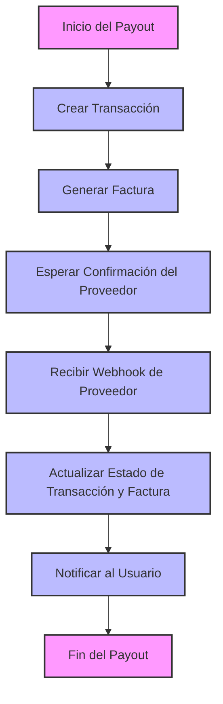

# Diagrama de Flujo para Payout

```mermaid
flowchart TD
    A[Inicio del Payout] --> B[Crear Transacción]
    B --> C[Generar Factura]
    C --> D[Esperar Confirmación del Proveedor]
    D --> E[Recibir Webhook de Proveedor]
    E --> F[Actualizar Estado de Transacción y Factura]
    F --> G[Notificar al Usuario]
    G --> H[Fin del Payout]

    style A fill:#f9f,stroke:#333,stroke-width:2px
    style B fill:#bbf,stroke:#333,stroke-width:2px
    style C fill:#bbf,stroke:#333,stroke-width:2px
    style D fill:#bbf,stroke:#333,stroke-width:2px
    style E fill:#bbf,stroke:#333,stroke-width:2px
    style F fill:#bbf,stroke:#333,stroke-width:2px
    style G fill:#bbf,stroke:#333,stroke-width:2px
    style H fill:#f9f,stroke:#333,stroke-width:2px
```

