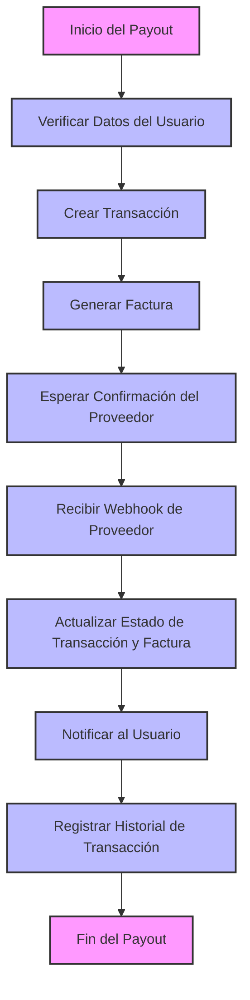

# Diagrama de Flujo para Payout

## Explicación del Diagrama de Flujo:

1. **Inicio del Payout**: Se inicia el proceso de payout cuando el usuario solicita el retiro.

2. **Verificar Datos del Usuario**: Se validan los datos del usuario para asegurarse de que cumpla con los requisitos.

3. **Crear Transacción**: Se crea una nueva transacción en la base de datos para el payout.

4. **Generar Factura**: Se genera una factura asociada a la transacción creada.

5. **Esperar Confirmación del Proveedor**: El sistema espera la confirmación del proveedor de servicios de pago.

6. **Recibir Webhook de Proveedor**: Una vez que el proveedor envía un webhook, el sistema recibe la notificación.

7. **Actualizar Estado de Transacción y Factura**: Se actualiza el estado de la transacción y la factura en la base de datos.

8. **Notificar al Usuario**: Se envía una notificación al usuario informándole sobre el estado del payout.

9. **Registrar Historial de Transacción**: Se registra el historial de la transacción para auditoría y seguimiento.

10. **Fin del Payout**: El proceso de payout se completa.
